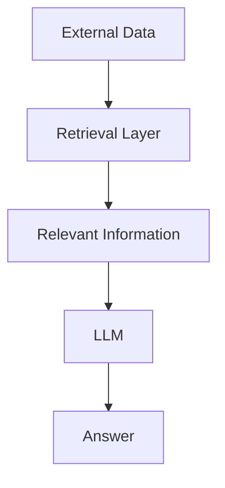
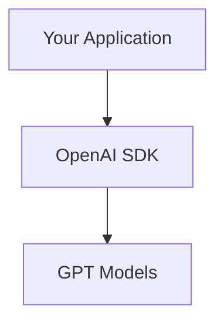
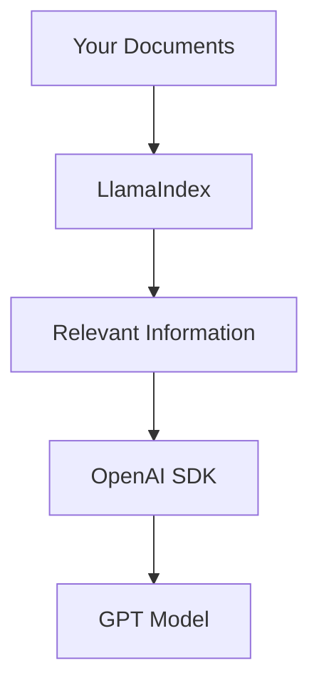
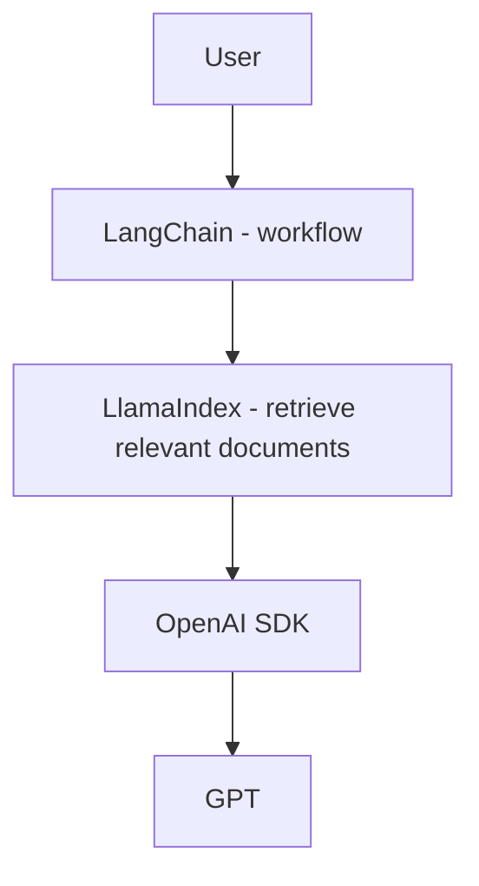
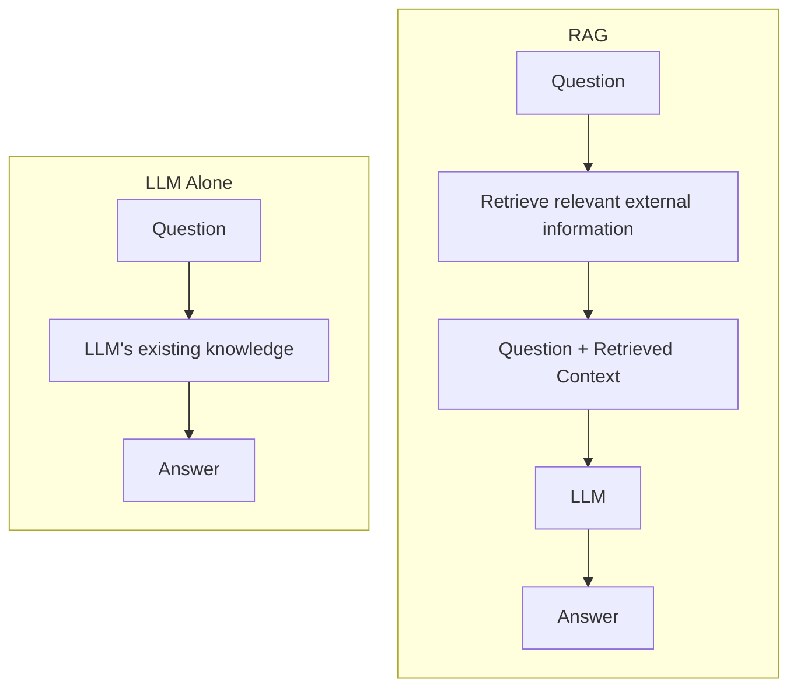
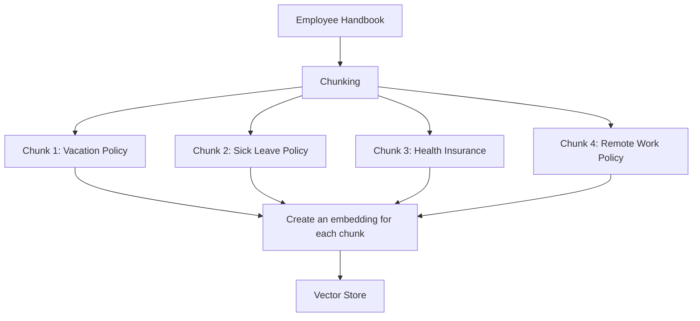
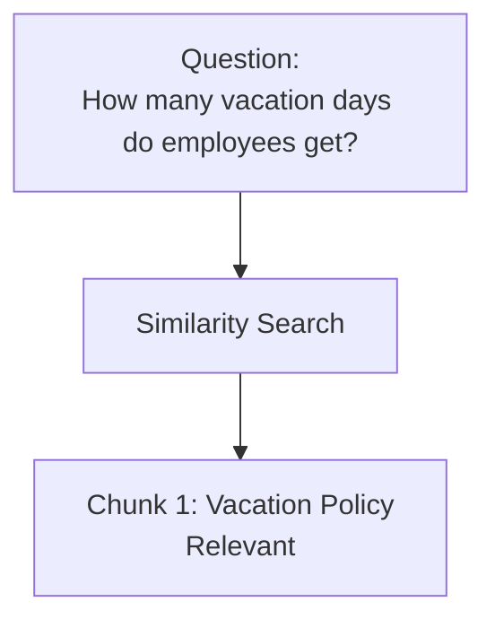
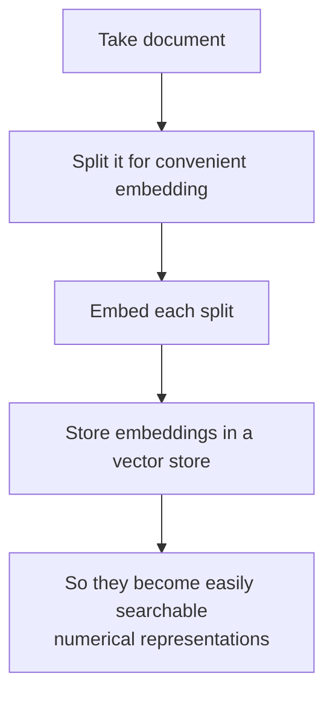
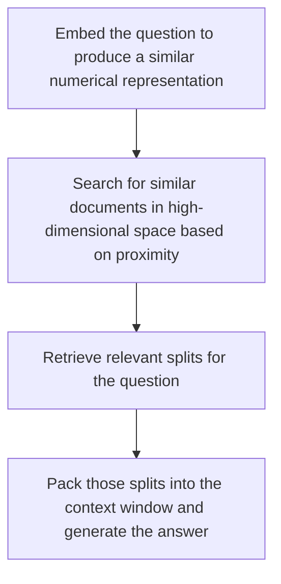
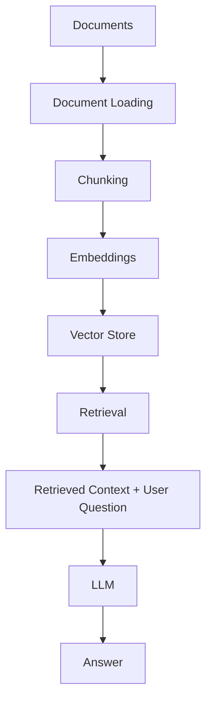

# Month 0 -- Understanding the AI Landscape

The goal of this month is to understand the AI landscape before building
AI applications.

To structure my learning, I am following the four-layer AI stack:

1.  [Foundation Layer (Models)](#foundation-layer---models)
2.  [Retrieval Layer](#retrieval-layer)
3.  Orchestration Layer
4.  Application Layer

## Foundation Layer - Models

To understand the foundation layer, I signed up for multiple model
providers:

-   OpenAI (Paid API)
-   Google Gemini
-   Groq

I built a React application that sends the same prompt to all models
simultaneously and displays their responses side by side. This allows me
to compare:

-   Personality
-   Strengths
-   Failure modes
-   Response time

The project is available in the **projects** directory.

The prompt comparisons and observations are documented in the
**experiments** directory.

### Key Takeaways

-   Different AI models have different personalities, strengths, and
    failure modes. There is no single "best" model.
-   Always choose a model based on the task rather than its popularity.
-   OpenAI provided the best overall balance for software engineering
    tasks in my testing.
-   Gemini excelled at detailed explanations, polished writing, and
    generating multiple alternatives.
-   Groq consistently delivered the fastest responses, making it ideal
    when low latency is important.
-   Running the same prompt across multiple models is one of the best
    ways to understand how they differ.
-   Speed alone does not determine quality; the fastest model is not
    always the most accurate.
-   Different models fail in different ways (for example, incorrect
    syntax, ignoring instructions, or being overly verbose).
-   Testing a variety of prompt types (writing, coding, reasoning,
    formatting, and constraints) provides a much more meaningful
    comparison than testing only one type of prompt.
-   As an AI engineer, understanding **when** to use each model is more
    valuable than finding a single favorite model.

### What I Learned

-   I understand the AI model landscape.
-   I know how to call multiple LLM APIs.
-   I can compare models based on personality, strengths, and failure
    modes.
-   I know that different models are better suited for different tasks.

## Retrieval Layer

The Retrieval Layer helps an AI application find relevant information from external data sources and provide that information to an LLM as context.

LLMs do not automatically have access to private, application-specific, or up-to-date information such as company documents, PDFs, databases, or knowledge bases. Instead of sending all available data to the LLM, the Retrieval Layer searches the available data and retrieves only the information relevant to the user’s question.

A simple way to think about the Retrieval Layer is:

In this section, I explore the tooling landscape to understand which problems different AI tools solve. I then explore Retrieval-Augmented Generation (RAG) to understand how external information can be indexed, retrieved, and provided to an LLM for generating an answer.

### Understanding the Tooling Landscape

To understand which problem each tool solves, I explored the following
three tools: 
1. OpenAI SDK 
2. LangChain 
3. LlamaIndex

#### OpenAI SDK

OpenAI SDK is official programming library that helps to talk to OpenAI
APIs without making HTTP requests.

##### Architecture

This SDK makes interaction with OpenAI models easy and reliable from
code.

#### LangChain:

LangChain is an orchestration framework for building LLM applications.
It is model agnostic and can work with many providers like OpenAI,
Anthropic, Google Gemini, etc.

##### Building Blocks

LangChain provides reusable building blocks to connect into one larger
AI workflow:

-   LLMs
-   Prompts
-   Tools
-   Memory / State
-   Retrieval
-   Agents
-   Application Logic

Imagine you're building an AI application.

Using the OpenAI SDK, you can ask GPT a question and get an answer. But
you are responsible for writing all the code that decides what happens
before and after that. For example:

-   Should the AI search the web first?
-   Should it look up information in a database?
-   Should it remember the previous conversation?
-   Should it call a calculator?
-   Should it ask another AI model?

All of that logic is your responsibility.

LangChain helps manage that complexity. Instead of writing all the
plumbing yourself, it gives you ready-made building blocks to connect
models, prompts, tools, memory, and application logic into a single
workflow.

##### Simple way to think about it

> **The OpenAI SDK helps you talk to an AI model. LangChain helps you
> build an entire AI application around that model.**

For example, if a user asks:

"What's the weather in New York, and should I carry an umbrella?"

With just the OpenAI SDK, you'd need to:

1.  Detect that weather information is needed.
2.  Call a weather API.
3.  Send the weather data back to the model.
4.  Generate the final answer.

LangChain provides abstractions for wiring these kinds of multi-step
workflows together, so you can focus more on your application's behavior
than on the underlying plumbing.

That's the real value of LangChain---it doesn't make the AI smarter, it
makes building AI applications easier.

#### LlamaIndex

Unlike LangChain, which helps you orchestrate AI workflows, LlamaIndex
focuses on one specific problem: helping LLMs use your own data.

Why was LlamaIndex created?

LLMs like GPT only know what they were trained on. They don't
automatically know about:

-   Your company's documents
-   PDFs
-   Word files
-   Notion pages
-   Google Drive
-   Databases
-   Emails
-   Internal knowledge bases

If you simply send all of this data to the model every time, you'll
quickly hit token limits and incur high costs.

LlamaIndex solves this by helping you organize, index, and retrieve only
the relevant information before sending it to the LLM.

In simple terms

Think of it this way:

-   OpenAI SDK = Talks to the AI model.
-   LangChain = Organizes the application's workflow.
-   LlamaIndex = Finds the right information from your data and gives it
    to the model.

Example

Suppose you build a chatbot for your company.

A user asks:

"What is our vacation policy?"

Without LlamaIndex:

-   You'd have to send the entire employee handbook to the model (slow
    and expensive).

With LlamaIndex:

1.  It searches your documents.
2.  Finds only the vacation policy section.
3.  Sends just that section to GPT.
4.  GPT generates the answer.

##### Architecture

##### Relationship with LangChain

They are complementary, not competitors.

-   LlamaIndex answers: "How do I find the right information?"
-   LangChain answers: "How do I connect everything together?"

A common architecture is:

##### Key Takeaway

LlamaIndex specializes in retrieval. It helps AI applications
efficiently search your own data and provide only the most relevant
information to the LLM, making responses more accurate, faster, and
cheaper. This is the foundation of most Retrieval-Augmented Generation
(RAG) applications.

#### Conclusion

These three tools work together rather than compete with each other.

-   **OpenAI SDK** is used to communicate with AI models.
-   **LangChain** helps build and organize complete AI applications.
-   **LlamaIndex** helps AI applications find and use information from
    your own data.

Knowing what each tool is designed for makes it much easier to choose
the right one instead of using a more complex solution than necessary.

### Understanding Retrieval Layer / RAG

to understand retrieval layer, I am following this resource: https://www.youtube.com/watch?v=sVcwVQRHIc8

what the Retrieval Layer is, why we need it, and how the RAG pipeline works.

RAG stands for **Retrieval Augmented Generation**

#### Understanding RAG Landscape

##### Query Translation

This block captures bunch of different methods to take a question from a user and modify it in some way to make it better suited for retrieval from different indexes. that can use methods like

1. query writing
2. decomposing a query into constituent sub questions

##### Routing

Taking that decomposed rewritten question and routing it to right vector stores, relational DB, graph DB and a vector store. so its a challenge of getting a question to the right source.

##### Query construction

this block takes natural language and converting it into the DSL necessary for DB we work with. 
e.g: 
1. text to SQL
2. text to Cipher for graph DB
3. text to metadata filters for vector DB

##### Indexing

This is the process of taking documents and processing them in some way so they can be easily retrieved and there are couple of technmiques including different embedding methods and indexing strategies.

##### Retrieval

##### Generation

#### RAG Motivation

##### Why RAG exist?
An LLM has two important limitations:
* Its trained knowledge is static and may be outdated.
* It doesn't inherently know your private/external data such as company documents, PDFs, DBs, policies, etc.

RAG addresses this by retrieving relevant information at query time and giving it to the LLM as context.

#### LLM Alone vs. RAG

The important distinction is that RAG normally does not retrain or modify the LLM. It supplies useful information in the prompt/context.

Main components of RAG pipeline:
1. [Indexing](#indexing-1)
2. [Retrieval](#retrieval-1)
3. [Generation](#Generation-1)

#### Indexing

First aspect of indexing is to load external documents to retriever and filter out relavant documents to a user question in some way. way to establish that relavance or relationship is done by numeric representation of documents. reason behind is that, it is easy to compare vector with numbers as compared to text.

There are lot of approaches to take text documents and compress them down to numeric representation that can be easily search, there are few ways to do that, they can be very easily search.

##### Chunking

Chunking is the process of splitting a large document into smaller pieces of text before creating embeddings.
for example:

**Why do we chunk?** 
Imagine storing 100 page employee handbook as one embedding.then someone asks: "How many vacation days do employee get?". the entire handbook would be represented as one large piece, even though only a small section contains the answer.

instead, if we split the document into smaller chunks, retrieval can find specifically:

This allows us to send only the relavant information to the LLM rather than the entire document.

##### Embeddings

An embedding converts text into a numerical representation (vector) that captures its semantic meaning.

The important concept is that embeddings allow us to compare text based on meaning rather than just matching exact words.

For example:

  <strong>User Question:</strong> 
  "How much PTO do employees get?" 
  ↓ 
  <strong>Relevant Document Chunk:</strong> 
  "Employees receive 15 days of paid vacation annually."

These sentences don't share many exact words, but they have related meanings. Their embeddings should therefore be relatively close in vector space.

  Text 
  ↓ 
  Embedding Model 
  ↓ 
  Vector (Numerical Representation) 
  ↓ 
  Stored in Vector Store

Later, the user's question is also embedded:

  Question 
  ↓ 
  Embedding 
  ↓ 
  Similarity Search 
  ↓ 
  Find document embeddings 
  that are semantically similar

#### Retrieval

Indexing process basically makes documents easy to retrieve. and that looks like, you take documents, you split it in some way so that can be easily embedded. those embedding are numerical representations of those documents which are easily searchable and then they stored in index, when given a question that's also embedded, the index performs similarity search and returns splits that are relavant to the question.

##### Retrieval powered via Similarity Search

Lets say we take a document and embed it. imagine that embedding has 3 dimentions, so each document is projected into some point in this 3D space. point is that the location in space is determined by the semantic meaning or content in this document. so documents in similar location in space contain similar semantic information. this is similar idea for a lot of search and retrieval methods that we see with modern vector stores.  

So in perticular we take our documents, embed them into in this case 3D space, we take a question and do the same, then we can do search like local neighborhood search in this 3D space around our question to find what documents are nearby. and then these nearby neighbors are retrieved, because they have similar semantics relative to our question.

#### Generation

Flow is like below 

##### Document Indexing Flow

 

##### Retrieval and Answer Generation Flow

  

##### Connecting Retrieval to LLMs

This introduces notion of a prompt, we can think of it as a placeholder for example in our case **Keys**, so these keys can be context and question. so we can build a doctionary from our retrieved documents and from our question and then we can populate our prompt template with the values from our dictionary and that becomes a prompt value which can be pass to LLM like a chat model, resulting in chat messages, which we can parse into a string and get our answer.

#### LangChain's Role in RAG

LangChain can be used to connect the different components of a RAG pipeline into a workflow.

LangChain provides abstractions and integrations for many of these steps, such as document loaders, text splitters, embedding models, vectore stores, retrieversm prompts and LLMs.

The important distinction is RAG is an architectural pattern, while LangChain is one framework that can be used to implement a RAG application. 

### Hands-on RAG

## Orchestration Layer

## Application Layer

## Conclusion